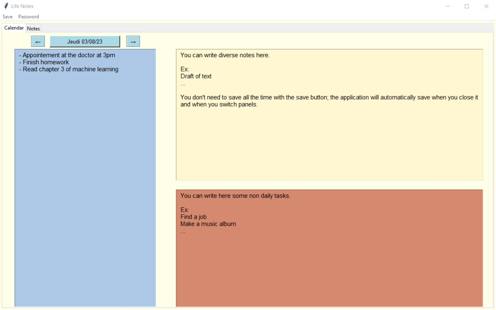

# life_notes
"life_notes.py" is a minimalist Python organization tool with a tkinter GUI. It provides features to manage your daily life, including daily notes management, calendar view, sticky notes, to-do lists, and password encryption. It's the perfect tool if you are looking for a life management application that is open-source, offline, and lightweight.

